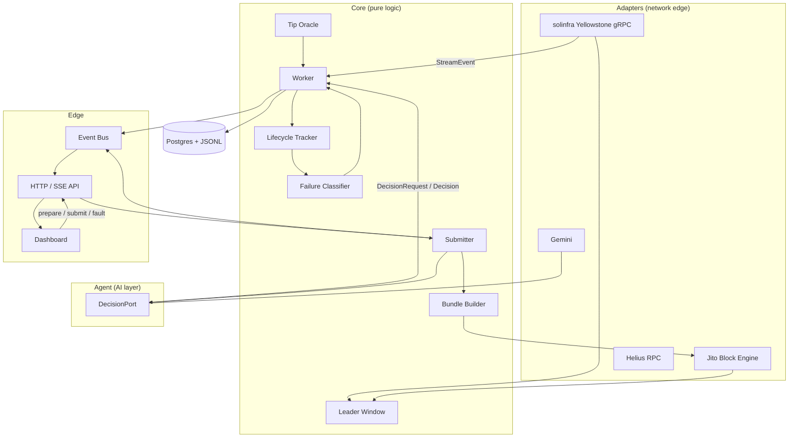
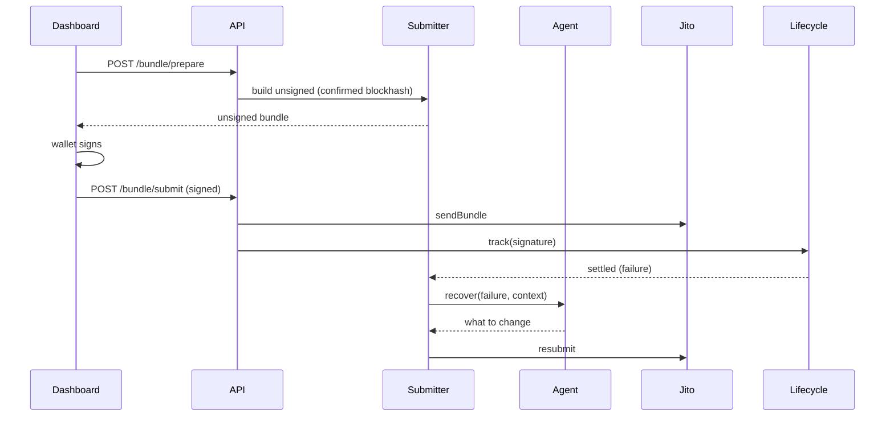
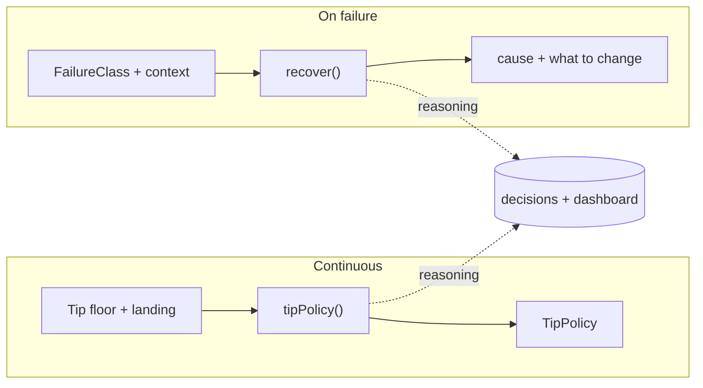

# Photon — Smart Transaction Stack Architecture

Photon is a smart Solana transaction stack. It observes the network in real time
over Yellowstone gRPC, submits transactions as Jito bundles, tracks every bundle
across all commitment levels, and lets an AI agent own one real operational
decision — **how much to tip** — plus the reasoning behind every failure.

It is one TypeScript backend plus a Next.js operator dashboard:

- **Backend** — adapters, core logic, the AI agent, persistence, and a realtime
  API. Runs headless (observe) or as a server (submission + SSE).
- **Dashboard** — an operator console that consumes the realtime API and provides
  a client-side wallet connector for signing.

The single hard rule: **no private key ever lives on the server.** The backend
builds unsigned bundles; the browser wallet signs them. A throwaway local signer
exists only for local testing and the autonomous-retry demo.

The design goal is a small, correct, infrastructure-grade system — never a
happy-path demo.

---

## 1. System architecture

Four boundaries:

- **Adapters** — the only code that touches the network: solinfra Yellowstone
  gRPC, Helius RPC, Jito, Gemini. Each hides behind a port interface.
- **Core** — pure logic: leader-window detection, tip data, bundle construction,
  the lifecycle state machine, failure classification, the worker (pipeline), and
  the submitter.
- **Agent** — the AI layer, reached only through a typed `DecisionPort`. The core
  never knows it is talking to an LLM.
- **Edge** — an in-process event bus, an HTTP/SSE API, and the dashboard.

---

## 2. Key components

| Component | Responsibility |
|---|---|
| **Yellowstone adapter** | Single gRPC subscription (commitment `processed`) to slot updates and to transactions touching the watched account. Owns reconnection, backpressure, the shed policy, and publishes stream health. |
| **Leader Window** | Asks the Jito engine for the next scheduled Jito leader and reports how many slots away the submission window is. |
| **Tip Oracle** | Pulls the live Jito tip floor (percentiles + EMA) and tracks observed landing. Pure data; it never decides the tip. |
| **Bundle Builder** | `buildUnsigned` (for the wallet) and `buildAndSign` (via the `Signer` port). Compute budget + payload + Jito tip, blockhash always at `confirmed`. Pluggable `TxPayload`. |
| **Lifecycle Tracker** | One state machine per signature: `submitted → processed → confirmed → finalized`, stamping slot + wall-clock at each transition and emitting them. Auto-opens on observed third-party txs; `track()`s our own submitted bundles with a blockhash-expiry watchdog. |
| **Failure Classifier** | Maps raw transaction errors and timeouts to a typed `FailureClass`. |
| **Worker** | Drives the pipeline: stream → tracker, refreshes the tip policy on a timer, persists settled lifecycles, runs failure reasoning, and routes submitted-bundle failures to the submitter. Holds no decision policy of its own. |
| **Submitter** | `submit` (build + sign + send + track + agent-driven retry + fault injection), `submitSigned` (the wallet-signed path). The retry policy comes entirely from the agent. |
| **Agent (`DecisionPort`)** | `tipPolicy()` — a continuously refreshed, reasoned tip policy. `recover()` — reasons about a failure and what to change before retrying. One Gemini model. |
| **Store** | Persists sealed lifecycles and every agent decision to Postgres (Drizzle) and appends a JSONL export. |
| **Event Bus + API** | A typed in-process bus (`slot`, `lifecycle`, `tip_policy`, `agent`, `stream`) exposed by a `node:http` server as an SSE firehose plus REST (`/bundle/prepare`, `/bundle/submit`, `/fault`, `/health`). |
| **Dashboard** | Next.js operator console: transaction-journey strip, status cards, the bundle-flow animation, the agent reasoning feed, the lifecycle log, and the wallet-connector submit flow. |

---

## 3. Data flow

**Observation.** The Yellowstone stream delivers a watched transaction at
`processed` → the tracker opens a lifecycle → slot commitment updates advance it
to `confirmed` then `finalized` → the worker seals it to Postgres + JSONL with
real latency deltas and publishes each transition to the bus. Failed transactions
are classified and reasoned about by the agent.

**Decision (continuous).** Every few seconds the worker refreshes the tip floor,
asks the agent for a `TipPolicy`, persists it, and publishes it. The submit path
reads this policy instantly, so LLM latency never sits in the hot path.

**Submission.** The dashboard calls `/bundle/prepare` → the builder returns an
unsigned bundle with a `confirmed` blockhash → the wallet signs it → the dashboard
posts the signed transaction to `/bundle/submit` → the submitter sends it to Jito
and the tracker follows our own bundle to finalization. On failure of a
locally-signed submission, the agent's `recover()` drives an autonomous retry.

---

## 4. Infrastructure decisions

- **All-TypeScript.** A single backend codebase plus a Next.js frontend. The
  AI/core split is enforced by the `DecisionPort` interface, not a process boundary.
- **solinfra Yellowstone gRPC, billed per GB.** Billing scales with subscription
  breadth, so the narrow-filter design (slots + one watched account, never the
  firehose) is also the cost control.
- **Helius free RPC** for blockhash and reconciliation.
- **Jito Frankfurt** Block Engine for tip accounts, leader schedule, and bundle
  submission.
- **Native `fetch`** for Jito, RPC, and Gemini — only Geyser needs a client lib.
- **Postgres (Drizzle)** for queryable lifecycle and decision history, plus a
  JSONL export of every sealed record for the bounty artifact.
- **Mainnet-beta**, so every slot number is verifiable on a public explorer.
- **No private key on the server.** Signing is the wallet connector's job; the
  backend only builds unsigned bundles. A throwaway local signer is gated behind
  an env var for testing and the autonomous-retry demo.

---

## 5. Failure handling strategy

- **Reconnection.** The Yellowstone adapter reconnects with exponential backoff
  and jitter, resubscribes, and publishes stream health (connected, dropped,
  reconnects).
- **Backpressure.** A bounded queue between the stream and consumers sheds *slot*
  updates (only the latest matters) but never *transaction* updates.
- **Typed failures.** `expired_blockhash`, `fee_too_low`, `compute_exceeded`,
  `bundle_dropped`, `leader_skipped`.
- **Fault injection.** A submission can be forced to use a stale blockhash,
  guaranteeing an `expired_blockhash` so the autonomous recovery path can be
  demonstrated on demand (`/fault` or `npm run fault`).
- **Two sources of truth.** The stream is primary; RPC is the reconciliation
  fallback — never RPC polling alone.

---

## 6. AI agent responsibilities

The agent owns **tip intelligence** as its primary decision and **failure
reasoning / recovery** as its second, both on a single Gemini model behind one
`DecisionPort`.

- **Tip policy (primary, continuous).** It reasons over live tip-floor
  percentiles, recent landing, and slot conditions, and publishes a `TipPolicy`
  (anchor percentile, multiplier, ceiling) that the submit path reads instantly.
  Every refresh is persisted with its reasoning and streamed to the dashboard.
- **Recovery (on failure).** Given a classified failure and current conditions, it
  decides what to change before retrying — refresh the blockhash, adjust the tip,
  or hold. The submitter holds no fallback policy, so the decision is genuinely
  the agent's.

Every decision is persisted to Postgres as an auditable reasoning trace and shown
live in the dashboard's reasoning feed.

---

## 7. Project status

- **Built:** streaming + lifecycle + tip/recovery agent + Postgres persistence,
  the submission core (build/sign/submit/track/retry/fault) behind the `Signer`
  port, the realtime API (SSE + REST), and the operator dashboard.
- **Pending live verification:** a funded mainnet run. The wallet connector
  supplies the signer; that run produces the explorer-verifiable lifecycle logs.
