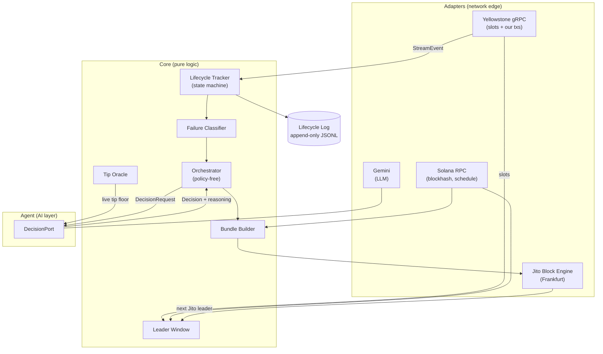
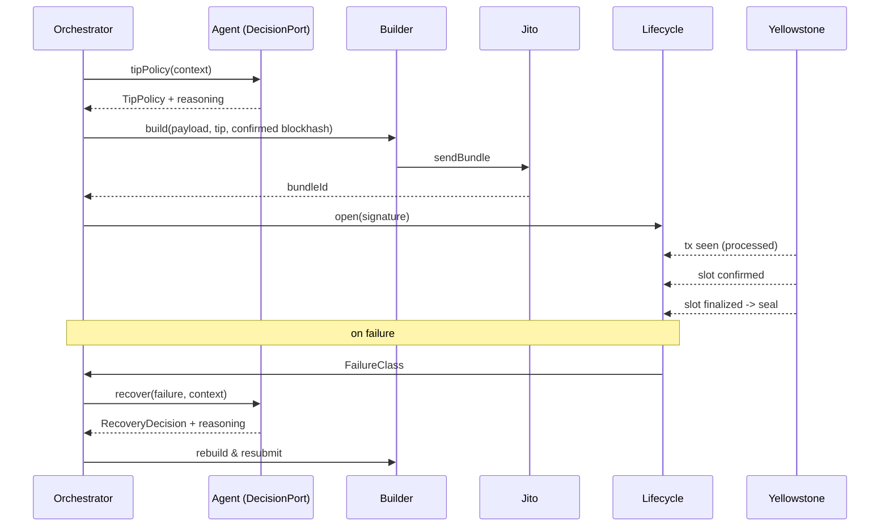
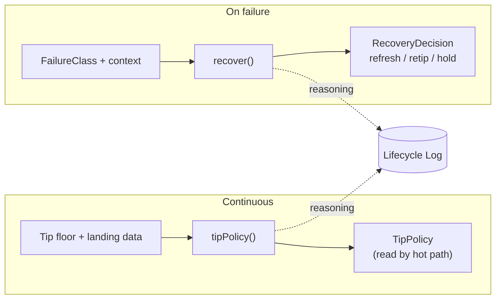

# Photon — Smart Transaction Stack Architecture

Photon observes Solana in real time, submits transactions as Jito bundles at the
right moment, tracks each bundle across every commitment level, and lets an AI
agent own one real operational decision: **how much to tip**, plus the reasoning
behind every recovery from failure.

The design goal is a small, correct, infrastructure-grade system — not a demo
that only works on the happy path.

---

## 1. System architecture

Photon is a single event-driven process built around three boundaries:

- **Adapters** — the only code that touches the network (Geyser gRPC, Jito,
  Solana RPC, Gemini). Everything network-bound hides behind a port interface.
- **Core** — pure transaction logic: leader-window detection, tip data, bundle
  construction, the lifecycle state machine, failure classification, and the
  orchestrator that drives submissions and retries.
- **Agent** — the AI layer. The core reaches it through a single typed
  `DecisionPort`. The core never knows it is talking to an LLM.

---

## 2. Key components

| Component | Responsibility |
|---|---|
| **Yellowstone adapter** | Single gRPC subscription to slot commitment updates and to transactions touching our wallet. Owns reconnection, backpressure, and the shed policy. |
| **Leader Window** | Asks the Jito engine for the next scheduled Jito leader and, using the live slot stream, reports whether the submission window is open or how many slots away it is. |
| **Tip Oracle** | Pulls the live Jito tip floor (percentiles + EMA) and records what we actually tipped versus whether it landed. Pure data — it never decides the tip. |
| **Bundle Builder** | Builds a versioned transaction (payload + compute budget + Jito tip), signs it, returns base64 for the bundle. Blockhash is always fetched at `confirmed`. Pluggable `TxPayload`. |
| **Lifecycle Tracker** | One state machine per signature: `submitted → processed → confirmed → finalized`, stamping slot + wall-clock at each transition and computing the deltas. A watchdog fires `expired_blockhash` if nothing lands inside the validity window. |
| **Failure Classifier** | Maps raw tx/bundle errors and watchdog timeouts to a typed `FailureClass`. |
| **Orchestrator** | Drives a submission and, on failure, asks the agent what to change and applies it. Contains **no** retry policy of its own. |
| **Agent (`DecisionPort`)** | `tipPolicy()` — a continuously refreshed tip policy the hot path reads instantly. `recover()` — on-failure reasoning that returns what to change before resubmitting. |

---

## 3. Data flow

**Submission.** Leader Window signals the Jito window is near → Orchestrator reads
the current `TipPolicy` and computes a tip from live floor data → Builder
constructs and signs the bundle with a fresh `confirmed` blockhash → Jito adapter
sends it → Lifecycle Tracker opens a state machine keyed on the signature.

**Confirmation.** The Yellowstone stream delivers the transaction (→ `processed`)
and then slot commitment updates for its slot (→ `confirmed` → `finalized`). The
tracker advances the state machine, records deltas, and seals the record to the
log on finalization. RPC polling exists only to reconcile stream gaps — it is
never the primary signal.

**Recovery.** The classifier turns a failure into a typed `FailureClass` →
Orchestrator sends a `DecisionRequest` to the agent → the agent reasons about the
cause and returns a `RecoveryDecision` (refresh blockhash? bump tip? hold for the
next leader?) → Orchestrator applies it and opens a new, linked lifecycle.

---

## 4. Infrastructure decisions

- **All-TypeScript, single process.** Optimized for shipping speed and one clean
  codebase. The AI/core split is enforced by the `DecisionPort` interface, not by
  a process boundary.
- **Native `fetch` for Jito, RPC, and Gemini.** Jito's Block Engine, the Solana
  JSON-RPC, and the Gemini API are all plain HTTP/JSON. Only Geyser needs a
  client library. This keeps the dependency surface to `@solana/web3.js` (tx
  construction) and the Yellowstone client.
- **Jito Frankfurt** Block Engine, co-located with the intended deploy region to
  minimize submission latency.
- **Mainnet-beta**, so every slot number in the lifecycle log is verifiable on a
  public explorer. Tips are tiny and bounded by a hard ceiling plus a total
  spend budget.

---

## 5. Failure handling strategy

Failure handling is a first-class concern, not an afterthought.

- **Reconnection.** The Yellowstone adapter reconnects with exponential backoff
  and jitter, resubscribes, and surfaces a gap so the tracker can reconcile via
  RPC instead of silently missing updates.
- **Backpressure.** A bounded queue sits between the gRPC stream and the
  consumers. Under overload it sheds *slot* updates (only the latest slot
  matters) and never drops *transaction* updates (a confirmation cannot be lost).
  Dropped-event count is logged as a health metric.
- **Two sources of truth.** The stream is primary; RPC reconciliation is the
  fallback. Neither is trusted blindly — "RPC polling alone is not sufficient."
- **Typed failures.** `expired_blockhash`, `fee_too_low`, `compute_exceeded`,
  `bundle_dropped`, `leader_skipped`. Each carries the context the agent needs to
  reason about it.
- **Fault injection.** A submission can be forced to use a stale blockhash,
  guaranteeing an `expired_blockhash` so the autonomous recovery path can be
  demonstrated on demand.
- **Cost guardrails.** The agent's tip is clamped to a hard ceiling and retries
  stop once the spend budget is reached.

---

## 6. AI agent responsibilities

The agent owns **tip intelligence** as its primary, standing decision, and
**recovery reasoning** as its on-failure decision.

- **Tip policy (primary).** Every few seconds the agent reasons over the live tip
  floor percentiles, recent landing rate, and current slot conditions, then
  publishes a `TipPolicy` (which percentile to anchor on, a multiplier, and a
  ceiling). The hot path reads this instantly, so LLM latency never sits in the
  submission path — yet the tip is a real, reasoned decision, logged with its
  rationale on every refresh.

- **Recovery (on failure).** When a bundle fails, the agent receives the failure
  class and current conditions and decides what to change before retrying —
  refresh the blockhash, adjust the tip, or hold for a better leader window. The
  orchestrator has no fallback policy, so the decision genuinely comes from the
  agent.

Every decision is persisted to the lifecycle log as a reasoning trace, so the
agent's behavior is auditable rather than a black box.

