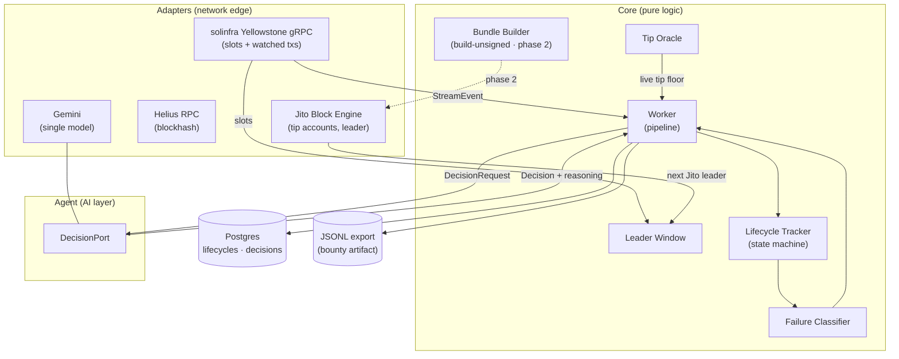
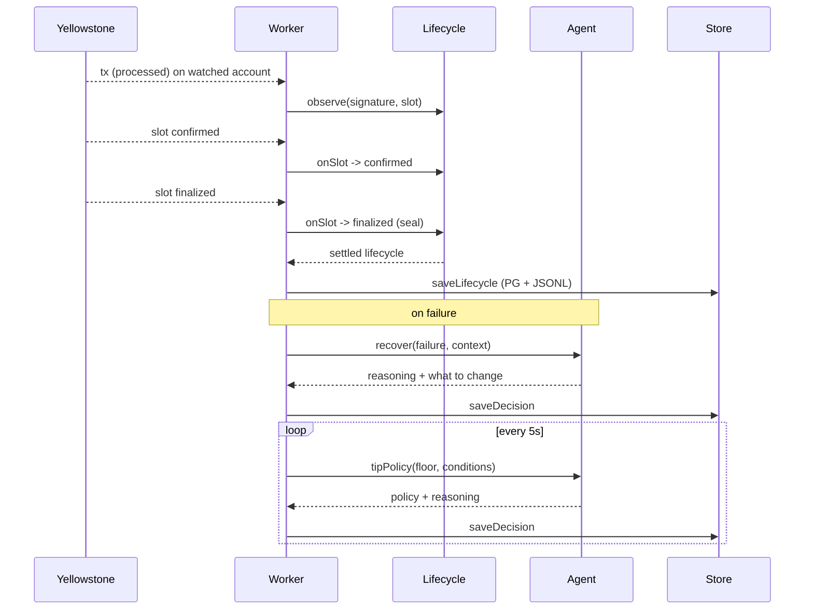
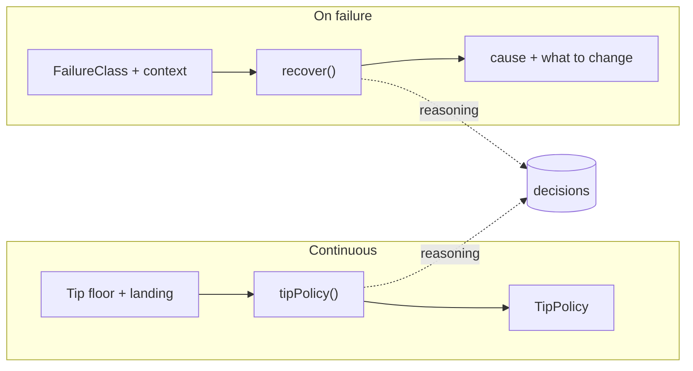

# Photon — Smart Transaction Stack Architecture

Photon is the backend of a smart Solana transaction stack. It observes the
network in real time over Yellowstone gRPC, tracks transactions across every
commitment level, and lets an AI agent own one real operational decision — **how
much to tip** — plus the reasoning behind every failure.

It is built in two phases:

- **Phase 1 (this repo today): observation + decision backend.** No wallet, no
  signing, no private key on the server. It streams live data, proves the
  lifecycle machinery against real on-chain transactions, runs the tip-policy and
  failure-reasoning agent, and persists everything to Postgres.
- **Phase 2: submission + dashboard.** A dashboard with a client-side wallet
  connector. The backend builds unsigned bundles, the browser wallet signs them,
  and the backend submits to Jito and tracks its own bundles. The seams for this
  (`build → sign → submit`) already exist.

The design goal is a small, correct, infrastructure-grade system — never a
happy-path demo.

---

## 1. System architecture

Three boundaries:

- **Adapters** — the only code that touches the network: solinfra Yellowstone
  gRPC, Helius RPC, Jito, Gemini. Each hides behind a port interface.
- **Core** — pure logic: leader-window detection, tip data, the lifecycle state
  machine, failure classification, bundle construction, and the worker that
  coordinates the pipeline.
- **Agent** — the AI layer, reached only through a typed `DecisionPort`. The core
  never knows it is talking to an LLM.

---

## 2. Key components

| Component | Responsibility |
|---|---|
| **Yellowstone adapter** | Single gRPC subscription (commitment `processed`) to slot updates and to transactions touching the watched account. Owns reconnection, backpressure, and the shed policy. |
| **Leader Window** | Asks the Jito engine for the next scheduled Jito leader and reports how many slots away the window is — context for the agent and the seam for phase-2 submission timing. |
| **Tip Oracle** | Pulls the live Jito tip floor (percentiles + EMA) and tracks observed landing. Pure data; it never decides the tip. |
| **Lifecycle Tracker** | One state machine per signature: `processed → confirmed → finalized`, stamping slot + wall-clock at each transition. In phase 1 it auto-opens on every observed transaction; in phase 2 it also tracks our own submitted bundles. |
| **Failure Classifier** | Maps raw transaction errors to a typed `FailureClass`. |
| **Worker** | Drives the pipeline: stream → tracker, refreshes the tip policy on a timer, and invokes failure reasoning on every observed failure. Contains no decision policy of its own. |
| **Bundle Builder** | Builds an unsigned bundle (compute budget + payload + Jito tip, `confirmed` blockhash). Signing is external. Exercised today via `npm run construct`. |
| **Agent (`DecisionPort`)** | `tipPolicy()` — a continuously refreshed, reasoned tip policy. `recover()` — reasons about a failure and what it would change. One Gemini model. |
| **Store** | Persists sealed lifecycles and every agent decision to Postgres (Drizzle) and appends a JSONL export. |

---

## 3. Data flow

**Observation (phase 1).** The Yellowstone stream delivers a watched transaction
at `processed` → the tracker opens a lifecycle and records its slot → slot
commitment updates for that slot advance it to `confirmed` then `finalized` →
the worker seals it to Postgres + JSONL with real latency deltas. Failed
transactions are classified and handed to the agent for reasoning.

**Decision (continuous).** Every few seconds the worker refreshes the tip floor,
asks the agent for a `TipPolicy`, and persists it with its reasoning. The policy
is what a phase-2 submission path reads to size its tip — so LLM latency never
sits in a submission hot path.

**Submission (phase 2).** Worker reads the current policy → Builder constructs an
unsigned bundle with a `confirmed` blockhash → the client wallet signs → the Jito
adapter submits → the tracker follows our own bundle to finalization, and the
agent's `recover()` drives autonomous retries.

---

## 4. Infrastructure decisions

- **All-TypeScript, single headless process.** One clean codebase; the AI/core
  split is enforced by the `DecisionPort` interface, not a process boundary.
- **solinfra Yellowstone gRPC, billed per GB.** Billing scales with subscription
  breadth, so the narrow-filter design (slots + one watched account, never the
  firehose) is also the cost control. The backpressure queue sheds slot updates
  under load and never drops transaction updates.
- **Helius free RPC** for blockhash and reconciliation.
- **Jito Frankfurt** for tip accounts and leader schedule now; bundle submission
  in phase 2.
- **Native `fetch`** for Jito, RPC, and Gemini — only Geyser needs a client lib.
- **Postgres (Drizzle)** for queryable lifecycle and decision history, plus a
  JSONL export of every sealed record for the bounty artifact.
- **Mainnet-beta**, so every slot number is verifiable on a public explorer.
- **No private key on the server.** Signing is a client-side wallet-connector
  concern; the backend only ever builds unsigned bundles.

---

## 5. Failure handling strategy

- **Reconnection.** The Yellowstone adapter reconnects with exponential backoff
  and jitter and resubscribes; dropped-event counts are logged.
- **Backpressure.** A bounded queue between the stream and consumers sheds *slot*
  updates (only the latest matters) but never *transaction* updates.
- **Typed failures.** `expired_blockhash`, `fee_too_low`, `compute_exceeded`,
  `bundle_dropped`, `leader_skipped`. Observed on-chain failures are classified
  and reasoned about by the agent today; in phase 2 the same path drives retries.
- **Two sources of truth.** The stream is primary; RPC is the reconciliation
  fallback — never RPC polling alone.

---

## 6. AI agent responsibilities

The agent owns **tip intelligence** as its primary decision and **failure
reasoning** as its second, both on a single Gemini model behind one `DecisionPort`.

- **Tip policy (primary, continuous).** It reasons over live tip-floor
  percentiles, recent landing, and slot conditions, and publishes a `TipPolicy`
  (anchor percentile, multiplier, ceiling) that a submission path can read
  instantly. Every refresh is persisted with its reasoning.
- **Failure reasoning (on failure).** Given a classified failure and current
  conditions, it explains the cause and what should change before retrying. In
  phase 2 this becomes the autonomous retry decision; the worker holds no
  fallback policy, so the decision is genuinely the agent's.

Every decision is persisted to Postgres as an auditable reasoning trace.

